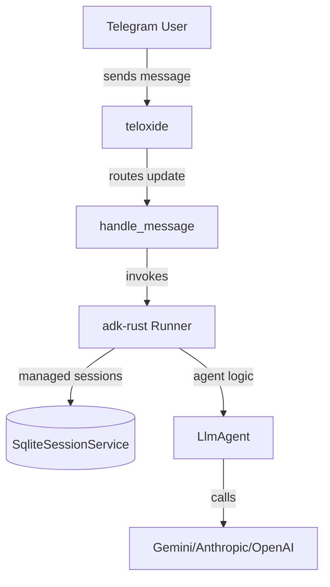

# Telegram AI Bot (ADK-Rust)

A modular, extensible AI-powered Telegram bot built on top of [adk-rust](https://github.com/google/adk-rust) and the [teloxide](https://github.com/teloxide/teloxide) framework. This project demonstrates how to leverage modern Rust libraries to build sophisticated AI agents with persistent sessions, filesystem sandbox capabilities, and dynamic skill management.

## 🖼️ Screenshot


## 🚀 Features

* **Multi-Platform AI**: Powered by Gemini, Anthropic, or any OpenAI-compatible LLM.
* **Persistent Sessions**: SQLite-backed conversation history per user.
* **Modular Skills**: Easily add new capabilities through a directory-based skill system.
* **Sandboxed Environment**: Integrated filesystem tools for agent tasks.
* **MCP Support**: Extensible via the Model Context Protocol.

## 🛠 Prerequisites

* Rust ([rustup](https://rustup.rs/))
* A Telegram Bot Token from [@BotFather](https://t.me/BotFather)
* API Key for your chosen LLM (Gemini, OpenAI, etc.)

## ⚙️ Configuration

1. Copy `.env.example` to `.env` and configure your credentials:

```bash
cp .env.example .env
```

```text
THAILLM_API_KEY=your-api-key-here
TELOXIDE_TOKEN=your_telegram_bot_token
SERPER_API_KEY=your_serper_api_key
```

## 🏃 Getting Started

The application provides three primary run modes:

| Mode | Command | Description |
| :--- | :--- | :--- |
| **Telegram Bot** | `cargo run -- bot` | Start the interactive Telegram bot. |
| **CLI** | `cargo run -- cli` | Local interactive terminal agent. |
| **Server** | `cargo run -- server` | Run as an HTTP service. |

## 🏗 Architecture

The system flows from Telegram updates through the Agent core:



* **teloxide**: Handles Telegram polling and updates.
* **adk-rust**: Core framework for AI agent logic and memory management.
* **SqliteSessionService**: Provides persistent `chat_id` keyed storage (`sessions.db`).

## 🧩 Extensions

### Skills System

Place new folders in the `.skills/` directory (root or workspace) containing a `SKILL.md` file. Supported skills include:

* `greeting`: Personalized welcome messages.
* `joke-generator`: Lighthearted interaction.
* `system_info`: Diagnostic machine metrics.
* `create-skill`: Self-scaffolding new skills.

### MCP Integration

1. Add `mcp.json` to your workspace folder.
2. Define your servers as shown in `mcp.json.example`.
3. Restart to automatically register MCP-based tools.

## 💡 Developer Tips

* **LLM Providers**: Configure your client in `src/agent/mod.rs`.
* **Tooling**: Extend capabilities by adding `adk` tools in `src/agent/mod.rs`.
* **Sandbox**: Workspace files are stored in `~/workspace` by default.
* **Production**: For high-traffic bots, migrate `teloxide` from polling to `axum_no_setup` webhooks.
