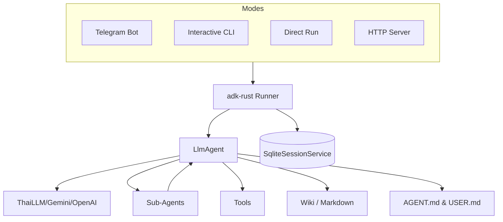

# Telegram AI Bot (ADK-Rust)

A modular, extensible AI-powered Telegram bot built on top of [adk-rust](https://github.com/google/adk-rust) and the [teloxide](https://github.com/teloxide/teloxide) framework. This project demonstrates how to leverage modern Rust libraries to build sophisticated AI agents with persistent sessions, filesystem sandbox capabilities, and dynamic persona management.

## 🖼️ Screenshot


## 🚀 Features

* **Multi-Platform AI**: Powered by Gemini, Anthropic, or any OpenAI-compatible LLM (e.g., ThaiLLM).
* **Modern TUI**: A rich, interactive CLI experience with a custom ASCII banner, animated indicators, and structured layout.
* **Markdown Wiki KM**: A transparent, human-readable Knowledge Management system using `.md` files.
* **Dynamic Persona & Soul**: Configure the bot's personality and user context via `AGENT.md` and `USER.md`.
* **Persistent Sessions**: SQLite-backed conversation history keyed by Telegram user ID.
* **Modular Tools**: Organized architecture for adding capabilities (Weather, Search, Shell, Wiki, etc.).
* **Live Web Search**: Integrated Google Search via Serper.dev.
* **Hierarchical Sub-Agents**: Support for delegation to specialized sub-agents via hierarchical task management.
* **Todo Management**: Integrated task tracking and list management.
* **Sandboxed Environment**: Integrated filesystem tools for agent tasks within a `workspace/` directory.

## 🛠 Prerequisites

* Rust ([rustup](https://rustup.rs/))
* A Telegram Bot Token from [@BotFather](https://t.me/BotFather)
* API Key for your chosen LLM (Gemini, OpenAI, or ThaiLLM)
* (Optional) [Serper.dev](https://serper.dev/) API Key for Google Search features.

## ⚙️ Configuration

1. Copy `.env.example` to `.env` and configure your credentials:

```bash
cp .env.example .env
```

```text
THAILLM_API_KEY=your-api-key-here
TELOXIDE_TOKEN=your_telegram_bot_token
SERPER_API_KEY=your_serper_api_key
```

1. Customize the Bot's Soul:

* Edit `AGENT.md` to change the name, personality, and tone.
* Edit `USER.md` to provide context about yourself and your preferences.

## 🏃 Getting Started

The application provides four primary run modes:

| Mode | Command | Description |
| :--- | :--- | :--- |
| **Telegram Bot** | `cargo run -- bot` | Start the interactive Telegram bot. |
| **CLI** | `cargo run -- cli` | Local interactive terminal agent with rich TUI. |
| **Run** | `cargo run -- run "prompt"` | Execute a single prompt directly from the CLI. |
| **Server** | `cargo run -- server` | Run as an HTTP service. |

## 🏗 Architecture

The system supports multiple entry points sharing the same core agent logic:



* **teloxide**: Handles Telegram polling and updates.
* **adk-rust**: Core framework for AI agent logic and memory management.
* **SqliteSessionService**: Provides persistent session storage (`sessions.db`).
* **Tools Subdirectory**: Located in `src/agent/tools/`, contains all functional modules.

## 🧩 Extensions

### Wiki Knowledge Management

The bot uses the `wiki/` directory in its workspace to store long-term knowledge.

* `add_wiki_page`: Saves new information as Markdown.
* `summarize_wiki`: Generates a `SUMMARY.md` index of all topics.
* `search_wiki`: Full-text search across all knowledge pages.

### Todo Management

The bot features a built-in task manager for tracking goals and daily items.

* `add_todo`: Create new tasks.
* `list_todos`: View current pending items.
* `complete_todo`: Mark tasks as finished.

### Persona & Memories

* **AGENT.md**: Defines the "Soul" of the bot.
* **USER.md**: Defines the context of the master.
* **MEMORIES.md**: Automatically updated by the bot when it learns personal facts about the user.

## 💡 Developer Tips

* **LLM Providers**: Configure your client in `src/agent/mod.rs`.
* **Adding Tools**: Add new modules to `src/agent/tools/` and register them in `src/agent/mod.rs`.
* **Sandbox**: Workspace files and wiki are stored in `./workspace/` by default.
* **Production**: For high-traffic bots, migrate `teloxide` from polling to webhooks.
