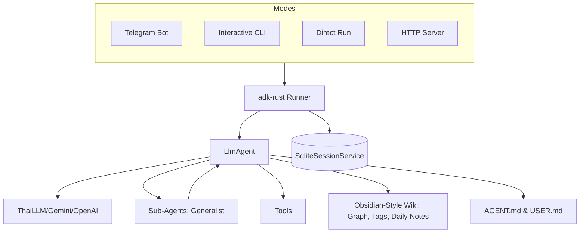

# namiClaw: Telegram AI Bot (ADK-Rust)

A modular, extensible AI-powered namiClaw built on top of [adk-rust](https://github.com/zavora-ai/adk-rust) and the [teloxide](https://github.com/teloxide/teloxide) framework. This project demonstrates how to leverage modern Rust libraries to build sophisticated AI agents with persistent sessions, filesystem sandbox capabilities, and dynamic persona management.


## 🚀 Features

* **Multi-Platform AI**: Powered by Gemini, Anthropic, or any OpenAI-compatible LLM (e.g., ThaiLLM).
* **Modern TUI**: A rich, interactive CLI experience with a custom ASCII banner, animated indicators, and structured layout.
* **@ File Context References**: Reference files from the `workspace/` directly in the CLI using `@path/to/file` with built-in Tab-completion.
* **Parallel Task Execution**: A custom `parallel_tasks` tool that orchestrates multiple sub-agents simultaneously for high-speed multi-tasking.
* **Markdown Wiki KM**: A transparent, human-readable Knowledge Management system using `.md` files.
* **Dynamic Persona & Soul**: Configure the bot's personality and user context via `AGENT.md` and `USER.md`.
* **Persistent Sessions**: SQLite-backed conversation history keyed by Telegram user ID.
* **Modular Tools**: Organized architecture for adding capabilities (Weather, Search, Shell, Wiki, etc.).
* **Live Web Search**: Integrated Google Search via Serper.dev.
* **Hierarchical Sub-Agents**: Support for delegation to a team of 7 specialized agents:
  - **Codebase Investigator**: Deep analysis & bug hunting.
  - **Generalist**: Batch tasks & data processing.
  - **Web Developer**: Full-stack web & API implementation.
  - **DevOps Engineer**: CI/CD, Docker & cloud infrastructure.
  - **Quality Assurance**: Automated testing & verification.
  - **Data Specialist**: Database design & analytics.
  - **Documentation Architect**: Technical knowledge & docs maintenance.
* **Todo Management**: Integrated task tracking and list management.
* **Sandboxed Environment**: Integrated filesystem tools for agent tasks within a `workspace/` directory, including the ability to merge multiple documents together using `merge_files`.

## 🛠 Prerequisites

* Rust ([rustup](https://rustup.rs/))
* A Telegram Bot Token from [@BotFather](https://t.me/BotFather)
* API Key for your chosen LLM (Gemini, OpenAI, or ThaiLLM)
* (Optional) [Serper.dev](https://serper.dev/) API Key for Google Search features.

## ⚙️ Configuration

1. Copy `.env.example` to `.env` and configure your credentials:

```bash
cp .env.example .env
```

```text
GOOGLE_API_KEY=your_google_api_key_here
THAILLM_API_KEY=your_api_key_here
TELOXIDE_TOKEN=your_telegram_bot_token
SERPER_API_KEY=your_serper_api_key
```

1. Customize the Bot's Soul:

* Edit `AGENT.md` to change the name, personality, and tone.
* Edit `USER.md` to provide context about yourself and your preferences.

## 🏃 Getting Started

### Build and Install

1. **Build the application**:

   ```bash
   cargo build --release
   ```

   The generated executable will be found in `target/release/`.

2. **(Optional) Install globally**:
   To run `namiclaw` from any directory, you can move the binary to a location in your system's `PATH`:

   * **Linux/macOS**:

     ```bash
     sudo mv target/release/namiclaw /usr/local/bin/
     ```

   * **Windows**:
     Add the full path of the `target\release\` directory to your system's Environment Variables (PATH).

### Running

The application provides five primary run modes:

| Mode | Command | Description |
| :--- | :--- | :--- |
| **Initialize** | `namiclaw init` | Initialize project config files and database. |
| **Telegram Bot** | `namiclaw bot` | Start the interactive Telegram Bot. |
| **CLI** | `namiclaw cli` | Local interactive terminal agent with rich TUI. |
| **Run** | `namiclaw run "prompt"` | Execute a single prompt directly from the CLI. |
| **Server** | `namiclaw serve` | Run as an HTTP service. |

## 🏗 Architecture

The system supports multiple entry points sharing the same core agent logic:



* **teloxide**: Handles Telegram polling and updates.
* **adk-rust**: Core framework for AI agent logic and memory management.
* **SqliteSessionService**: Provides persistent session storage (`sessions.db`).
* **Modes**: Located in `src/modes/`, contains application entry points (Bot, CLI, Server, etc.).
* **Tools**: Located in `src/tools/`, contains all functional modules.

## 🧩 Extensions

### Obsidian-Style Wiki Knowledge Management

The bot uses the `wiki/` directory in its workspace to store long-term knowledge, now with Obsidian-style features:

* `add_wiki_page`: Saves new information as Markdown, with support for `[[wikilink]]` syntax.
* `get_wiki_graph`: Generates a JSON representation of your knowledge graph's nodes and edges.
* `search_wiki_by_tag`: Filters notes by specific `#tags`.
* `create_daily_note`: Creates a journal entry for the current date.
* `summarize_wiki`: Generates a `SUMMARY.md` index of all topics.
* `search_wiki`: Full-text search across all knowledge pages.
* `get_backlinks`: Lists all pages that link to a specific note.
* `apply_template`: Applies a structured template to a wiki page.
* `check_broken_links`: Identifies and reports dead wikilinks.
* `rename_wiki_page`: Safely renames a page and updates all incoming links.

### Todo Management

The bot features a built-in task manager for tracking goals and daily items.

* `add_todo`: Create new tasks.
* `list_todos`: View current pending items.
* `mark_todo_done`: Mark tasks as finished.
* `remove_todo`: Permanently delete a task.

### Persona & Memories

* **AGENT.md**: Defines the "Soul" of the bot.
* **USER.md**: Defines the context of the master.
* **MEMORIES.md**: Automatically updated by the bot when it learns personal facts about the user.

### Publishing Skills

The bot includes built-in skills to compile your workspace documents into distributable formats:

* `create-pdf`: Converts Markdown files into beautifully formatted PDF documents (requires `md-to-pdf`).
* `create-epub`: Compiles Markdown files into EPUB e-books with automatic BOM sanitization (requires `md-to-epub`).

## 💡 Developer Tips

* **LLM Providers**: Gemini is the default model. You can configure or switch to other supported models in `src/agent/mod.rs`.
* **Adding Tools**: Add new modules to `src/tools/` and register them in `src/agent/mod.rs`.
* **Sandbox**: Workspace files and wiki are stored in `./workspace/` by default.
* **Production**: For high-traffic bots, migrate `teloxide` from polling to webhooks.
